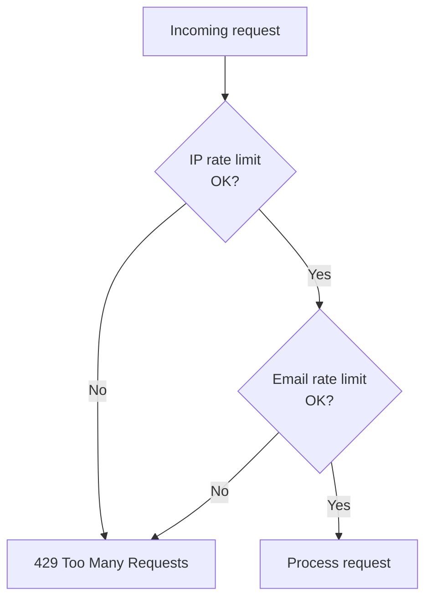
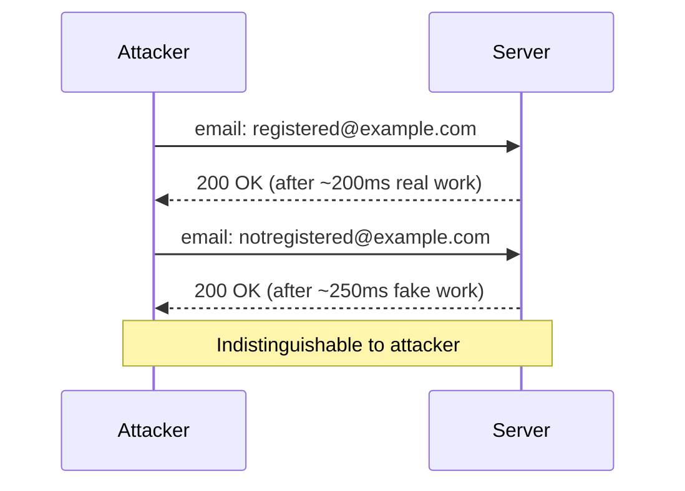
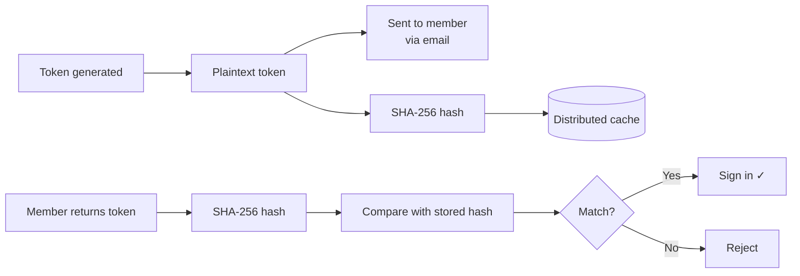

# Security

This page explains the security features built into the library. Most of these work automatically — you don't need to configure anything — but understanding them is useful if you're evaluating the library or conducting a security review.

## Rate limiting

Every endpoint that could be abused has rate limiting applied automatically.

Rate limits are implemented as a sliding window using the distributed cache (`IDistributedCache`). The limits are configurable in `HCS:Authentication:RateLimits`:

| Setting | Default | Applies to |
|---------|---------|-----------|
| `PerIpRequestsPerMinute` | `10` | POST to `/request` endpoints (magic link, OTP) |
| `PerEmailRequestsPerHour` | `5` | POST to `/request` endpoints (per email address) |
| `VerifyPerIpPerMinute` | `20` | POST to `/verify` endpoint (OTP) |
| WebAuthn completion | `5 per IP per minute` | POST to `/auth/webauthn/signin/complete` (hardcoded) |

Rate limiting keys for email-based limits use a **hash of the email address**, never the plaintext. This protects member email addresses even if the cache contents were ever exposed.

## Timing attack protection

A timing attack is when an attacker measures how long your server takes to respond and uses that information to infer something secret — for example, whether a given email address is registered.

The library guards against this in two ways:

### FakeWork delays

When an email address is submitted but no matching member is found, the server sleeps for approximately 250ms (with ±50% random jitter) before responding. This makes the response time indistinguishable from a genuine lookup.

### Constant-time comparison

All token and code comparisons use `CryptographicOperations.FixedTimeEquals()` from the .NET runtime. A naive string comparison (`==`) returns early as soon as it finds a mismatching character, leaking information about how many characters matched. Constant-time comparison always takes the same amount of time regardless of where the mismatch occurs.

## Token hashing

Tokens and OTP codes are never stored in plaintext — not in the database, not in the cache.

If someone gained access to your cache or database, they would find only hashed values — useless without the original token, which exists only in the member's email inbox.

## Single-use enforcement

Magic link tokens (when `SingleUse: true`, the default) and OTP codes are consumed immediately on first use. The `ISingleUseTokenStore` records the hash as used in the distributed cache. Any subsequent request with the same token finds the used marker and rejects the attempt.

This means:
- A link forwarded by accident can't be used by anyone else after the first click
- Phishing sites that try to replay captured tokens have a very narrow window to do so
- Replay attacks are blocked even if the attacker intercepts the network traffic

## Return URL validation

After a successful sign-in, the library redirects to the `returnUrl` submitted with the request. To prevent **open redirect attacks** (where a phishing link sends `returnUrl=https://evil.com` and the member ends up on an attacker's site), the library validates the URL before using it.

Only **local relative paths** are accepted:

| URL | Allowed? | Reason |
|-----|----------|--------|
| `/member` | ✓ Yes | Safe local path |
| `/members/profile?tab=settings` | ✓ Yes | Safe local path with query |
| `https://evil.com` | ✗ No | Absolute URL — redirect to configured fallback |
| `//evil.com` | ✗ No | Protocol-relative — treated as external |
| `javascript:alert(1)` | ✗ No | Non-HTTP scheme |

Invalid return URLs silently fall back to `PostLoginRedirectPath` (default `/`).

## WebAuthn security

### Origin and domain binding

The WebAuthn protocol binds authentication to your **exact domain**. When a passkey is created, the browser embeds the origin (`https://yoursite.com`) in the credential. When the member signs in, the browser checks that the page requesting authentication is the same origin.

A phishing site at `https://yoursite.com.evil.com` **cannot** use passkeys registered for `yoursite.com`. The signature will fail verification on your server because the origin in the client data won't match.

The library enforces this via the `Origins` configuration option and the Fido2NetLib library's built-in validation.

### Signature counter regression detection

Every time a passkey is used to sign in, the authenticator increments an internal counter and includes it in the assertion. Your server stores the last-seen counter value.

If the received counter is **less than or equal to** the stored value (and the authenticator uses a non-zero counter), this could indicate the passkey was cloned — the original private key was extracted and copied to another device.

When this happens:
1. The library logs a warning with the member key and credential ID
2. A `PasskeyCounterRegressionNotification` event is published (see [Advanced](advanced.md))
3. The sign-in is **rejected**

> **Platform passkeys note:** Many modern platform passkeys (iCloud Keychain, Google Password Manager) use a counter of `0` to indicate "I don't track usage count". This is handled correctly — a counter of `0` skips the regression check entirely, which is per-spec behaviour.

### Single-use challenges

Every WebAuthn ceremony (registration or sign-in) produces a unique challenge stored in the distributed cache. The challenge is consumed atomically when it's retrieved — if two requests arrive with the same ceremony ID simultaneously, only one succeeds.

This prevents **replay attacks** where an attacker captures a valid ceremony and tries to replay it later.

## Single-instance vs multi-instance

The token replay store (`ISingleUseTokenStore`) and OTP attempt counter (`IAttemptCounter`) use in-process memory by default. This is correct and race-free for a single Umbraco instance. If you run multiple instances behind a load balancer, each instance has its own memory and they cannot coordinate — the same magic link token could be accepted twice, or the OTP lockout could fail to trigger.

If you are on a single instance (the most common Umbraco setup), no action is required.

If you are running multiple instances, see [Multi-Instance Deployments](multi-instance.md) for Redis and SQL Server replacement implementations.

The OTP code store (`IOtpCodeStore`) and WebAuthn challenge store (`IWebAuthnChallengeStore`) use `IDistributedCache`. Configure a shared Redis cache via `AddStackExchangeRedisCache` and they will coordinate across instances automatically.

## Security summary

| Threat | Mitigation |
|--------|-----------|
| User enumeration via timing | FakeWork delays on all "member not found" paths |
| Brute-force token guessing | Short-lived tokens + single-use enforcement + rate limiting |
| Token replay | Single-use store marks tokens consumed on first use |
| Phishing (magic link / OTP) | Tokens expire quickly; single-use; rate limiting per email |
| Phishing (passkeys) | Cryptographically bound to your exact domain — unphishable |
| Open redirect | ReturnUrl validation rejects all non-local paths |
| Cache timing side-channel | Constant-time comparison on all token checks |
| Plaintext token exposure | SHA-256 hash stored, never plaintext |
| Cloned passkeys | Signature counter regression detection |
| DDoS on sign-in endpoint | Per-IP rate limiting on all sign-in paths |
