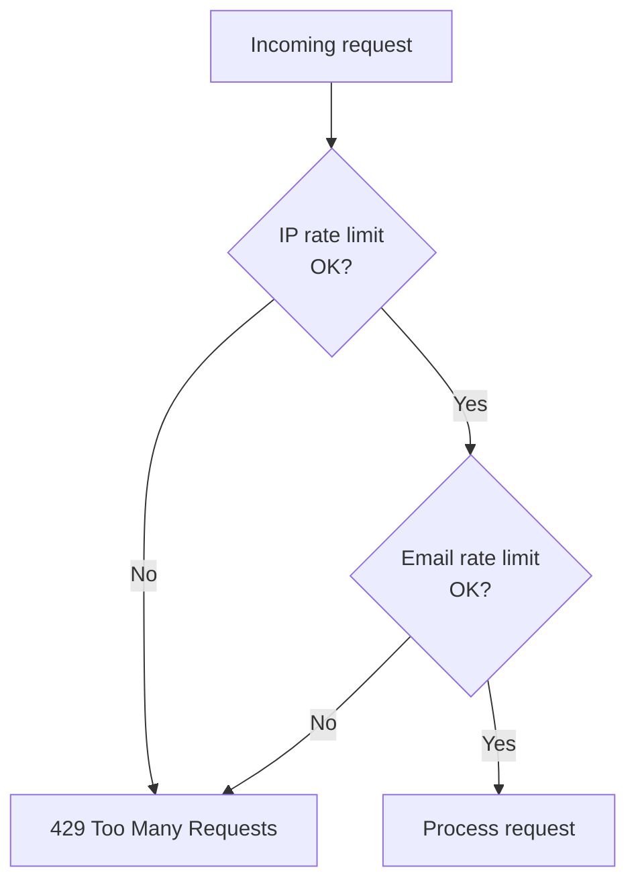
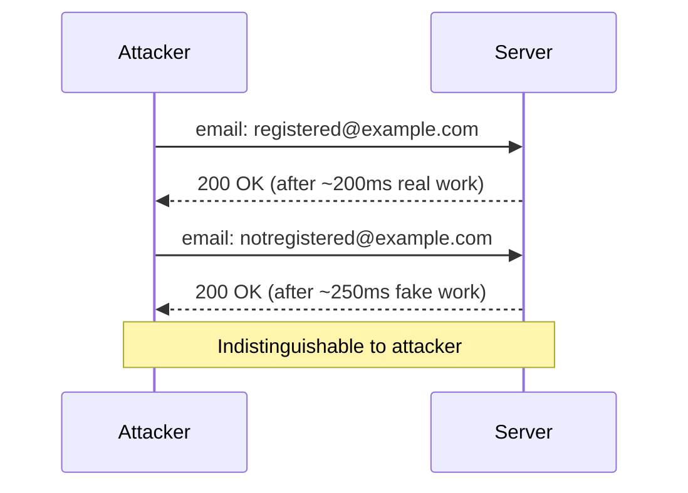
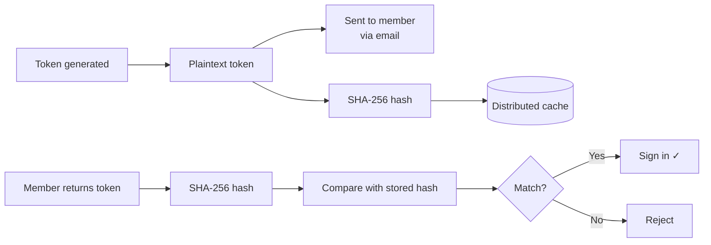

# Security

This page explains the security features built into the library. Most of these work automatically — you don't need to configure anything — but understanding them is useful if you're evaluating the library or conducting a security review.

## Rate limiting

Every endpoint that could be abused has rate limiting applied automatically.



Rate limits are implemented as a sliding window using the distributed cache (`IDistributedCache`). The limits are configurable in `HCS:Authentication:RateLimits`:

| Setting | Default | Applies to |
|---------|---------|-----------|
| `PerIpRequestsPerMinute` | `10` | POST to `/request` endpoints (magic link, OTP) |
| `PerEmailRequestsPerHour` | `5` | POST to `/request` endpoints (per email address) |
| `VerifyPerIpPerMinute` | `20` | POST to `/verify` endpoint (OTP) |
| WebAuthn sign-in options | `SignInOptionsPerIpPerMinute` (default `10`) | POST to `/auth/webauthn/signin/options` |
| WebAuthn completion | `SignInCompletePerIpPerMinute` (default `5`) | POST to `/auth/webauthn/signin/complete` |

Rate limiting keys for email-based limits use a **hash of the email address**, never the plaintext. This protects member email addresses even if the cache contents were ever exposed.

## Timing attack protection

A timing attack is when an attacker measures how long your server takes to respond and uses that information to infer something secret — for example, whether a given email address is registered.

The library guards against this in two ways:

### FakeWork delays

When an email address is submitted but no matching member is found, the server sleeps for `FakeWorkDelay` (default 250ms, ±50% jitter) before responding. This makes the response time indistinguishable from a genuine lookup.

> **Tuning required:** The 250ms default is calibrated for fast local SMTP. If your transactional email provider delivers slowly, the real "email sent" path will take longer than the fake path, leaking timing information. See the [FakeWorkDelay note in configuration](configuration.md#rate-limits-hcsauthenticationratelimits) for tuning guidance.



### Constant-time comparison

All token and code comparisons use `CryptographicOperations.FixedTimeEquals()` from the .NET runtime. A naive string comparison (`==`) returns early as soon as it finds a mismatching character, leaking information about how many characters matched. Constant-time comparison always takes the same amount of time regardless of where the mismatch occurs.

## Token hashing

Tokens and OTP codes are never stored in plaintext — not in the database, not in the cache.



If someone gained access to your cache or database, they would find only hashed values — useless without the original token, which exists only in the member's email inbox.

## Single-use enforcement

Magic link tokens (when `SingleUse: true`, the default) and OTP codes are consumed immediately on first use. The `ISingleUseTokenStore` records the hash as used in the distributed cache. Any subsequent request with the same token finds the used marker and rejects the attempt.

This means:
- A link forwarded by accident can't be used by anyone else after the first click
- Phishing sites that try to replay captured tokens have a very narrow window to do so
- Replay attacks are blocked even if the attacker intercepts the network traffic

## Return URL validation

After a successful sign-in, the library redirects to the `returnUrl` submitted with the request. To prevent **open redirect attacks** (where a phishing link sends `returnUrl=https://evil.com` and the member ends up on an attacker's site), the library validates the URL before using it.

Only **local relative paths** are accepted:

| URL | Allowed? | Reason |
|-----|----------|--------|
| `/member` | ✓ Yes | Safe local path |
| `/members/profile?tab=settings` | ✓ Yes | Safe local path with query |
| `https://evil.com` | ✗ No | Absolute URL — redirect to configured fallback |
| `//evil.com` | ✗ No | Protocol-relative — treated as external |
| `javascript:alert(1)` | ✗ No | Non-HTTP scheme |

Invalid return URLs silently fall back to `PostLoginRedirectPath` (default `/`).

## WebAuthn security

### Origin and domain binding

The WebAuthn protocol binds authentication to your **exact domain**. When a passkey is created, the browser embeds the origin (`https://yoursite.com`) in the credential. When the member signs in, the browser checks that the page requesting authentication is the same origin.

A phishing site at `https://yoursite.com.evil.com` **cannot** use passkeys registered for `yoursite.com`. The signature will fail verification on your server because the origin in the client data won't match.

The library enforces this via the `Origins` configuration option and the Fido2NetLib library's built-in validation.

### Signature counter regression detection

Every time a passkey is used to sign in, the authenticator increments an internal counter and includes it in the assertion. Your server stores the last-seen counter value.

If the received counter is **less than or equal to** the stored value (and the authenticator uses a non-zero counter), this could indicate the passkey was cloned — the original private key was extracted and copied to another device.

When this happens:
1. The library logs a warning with the member key and credential ID
2. A `PasskeyCounterRegressionNotification` event is published (see [Advanced](advanced.md))
3. The sign-in is **rejected**

> **Platform passkeys note:** Many modern platform passkeys (iCloud Keychain, Google Password Manager) use a counter of `0` to indicate "I don't track usage count". This is handled correctly — a counter of `0` skips the regression check entirely, which is per-spec behaviour.

### Single-use challenges

Every WebAuthn ceremony (registration or sign-in) produces a unique challenge stored in the distributed cache. The challenge is consumed atomically when it's retrieved — if two requests arrive with the same ceremony ID simultaneously, only one succeeds.

This prevents **replay attacks** where an attacker captures a valid ceremony and tries to replay it later.

## Single-instance vs multi-instance

The token replay store (`ISingleUseTokenStore`) and OTP attempt counter (`IAttemptCounter`) use in-process memory by default. This is correct and race-free for a single Umbraco instance. If you run multiple instances behind a load balancer, each instance has its own memory and they cannot coordinate — the same magic link token could be accepted twice, or the OTP lockout could fail to trigger.

If you are on a single instance (the most common Umbraco setup), no action is required.

If you are running multiple instances, see [Multi-Instance Deployments](multi-instance.md) for Redis and SQL Server replacement implementations.

The OTP code store (`IOtpCodeStore`) and WebAuthn challenge store (`IWebAuthnChallengeStore`) use `IDistributedCache`. Configure a shared Redis cache via `AddStackExchangeRedisCache` and they will coordinate across instances automatically.

### Startup warning for in-process cache

When the application starts, the library checks whether `IDistributedCache` resolves to the default `MemoryDistributedCache`. If it does, it logs a `Warning`-level message:

```
HCS Passwordless: IDistributedCache is using MemoryDistributedCache (in-process, node-local). ...
```

This warning is harmless on a genuine single-instance deployment and can be suppressed by raising the log level for `HCS.Umbraco.Passwordless` above `Warning`. On a multi-instance deployment, act on the warning before going live — replace `IDistributedCache` with a shared implementation as described in [Multi-Instance Deployments](multi-instance.md).

## Accepted risks and operator responsibilities

The following risks are known, understood, and accepted by design. The library cannot resolve them on your behalf — they require action or judgement on your part as the operator.

### FooterHtml is rendered as raw HTML (M-1)

`BrandingOptions.FooterHtml` is rendered with `Html.Raw` in the default email layout. The library has no way to know what HTML is "safe" for your use case, and HTML sanitisation is a complex domain-specific problem.

**What this means:** If you populate `FooterHtml` from user input, a database column, or a backoffice field without sanitising it first, an attacker who can write to that source can inject arbitrary HTML into every transactional email sent by your site. This is a stored-XSS path in email.

**What to do:** Only set `FooterHtml` to a hardcoded string in `appsettings.json`. If you need the value to be editable at runtime, sanitise it before use — [HtmlSanitizer](https://github.com/mganss/HtmlSanitizer) is a well-maintained option. If in doubt, leave `FooterHtml` as `null` and rely on the default footer text.

---

### FakeWorkDelay default may not cover your SMTP latency (M-2)

The default `FakeWorkDelay` of 250ms is calibrated for fast, co-located SMTP. It is a minimum starting point, not a safe universal value.

**What this means:** If your email provider is slower than the fake delay (common with cross-region relays or shared transactional email services), an attacker who can make many requests will observe that unknown emails get a faster response than known ones, revealing which email addresses are registered.

**What to do:** Measure the 95th-percentile delivery time of your transactional email provider and raise `FakeWorkDelay` to at least that value. For most cloud email providers 1–2 seconds is appropriate. This is an expected latency cost — every unauthenticated request to a `/request` endpoint will take at least that long.

---

### OTP per-account lockout can be used to deny service to a targeted member (M-9)

The OTP attempt counter is keyed on member ID. An attacker who knows (or guesses) a member's email address can deliberately exhaust their OTP attempt budget, locking them out of OTP sign-in for `LockoutDuration`.

**What this means:** This is intentional — per-account lockout is the [NIST SP 800-63B](https://pages.nist.gov/800-63-3/sp800-63b.html) recommended approach for preventing brute-force attacks. The alternative (per-IP lockout only) would allow distributed brute-force attacks that bypass the counter entirely.

**What to do:** If the DoS risk is a concern for your deployment, consider:
- Sending the member an email notification when their account is locked out (implement a handler for the lockout path in your own code — the library does not send one by default).
- Reducing `LockoutDuration` to minimise the window of denial.
- Requiring a second factor alongside OTP for high-value accounts.

---

### WebAuthn settings do not hot-reload (M-5)

`RpId`, `Origins`, and other WebAuthn settings are captured once when the application starts and held for the lifetime of the process. Runtime changes to `appsettings.json` are ignored until the application is restarted.

**What this means:** This is intentional and is the safer posture. If hot-reload were supported, an attacker with write access to the configuration source could inject a malicious origin and bypass passkey domain-binding guarantees mid-flight. Locking in the values at startup prevents this.

**What to do:** Treat WebAuthn settings as deployment-time configuration. Any change to `HCS:Authentication:WebAuthn` (origins, RP ID, user verification policy, etc.) requires an application restart to take effect.

---

### Magic-link token visible in URL, browser history, and access logs (L-3)

Magic-link tokens are delivered as a query-string parameter in the verification URL:

```
https://yoursite.com/auth/magic-link/verify?email=…&token=RAW_TOKEN&returnUrl=…
```

This means the raw token appears in:
- **Server access logs** (Nginx, IIS, Kestrel's request log)
- **Browser history** on the device that clicked the link
- **Referer headers** if the page linked-to contains third-party resources

**What this means:** If someone gains access to server access logs or the member's browser history before the link is used, they could attempt to use the token. However, the risk is substantially limited by single-use enforcement — the token is invalidated on first click and is useless after that.

**What to do:** For most deployments the risk is acceptable — magic links are widely used in this form and the single-use guarantee is the primary control. If your threat model requires stronger protection:
- Ensure server access logs are access-controlled and retained only as long as necessary.
- Consider implementing a PKCE-style exchange where the URL contains a short opaque code that is exchanged for the actual token in a POST request — this keeps the token out of URLs entirely.

---

### FakeWork jitter is theoretically fingerprintable (L-2)

The `FakeWork` delay is a uniform random value between 50% and 100% of `FakeWorkDelay`. Over many samples, an adversary with a statistical analysis tool could detect the uniform distribution shape and confirm that a given path uses FakeWork rather than performing real work.

**What this means:** In practice, network round-trip jitter (typically 10–50ms of variance) dominates the measured distribution and masks the uniform jitter entirely. This is a theoretical concern, not a practical one for any realistic deployment.

**What to do:** No action required. If you operate in an environment where sub-millisecond network timing is available to an adversary (unlikely for a web application), consider using a Gaussian jitter distribution by customising the `IPasswordlessRateLimiter` or wrapping the endpoints.

---

### Debug logging exposes security stamps (M-4)

When the log level for `HCS.Umbraco.Passwordless` is set to `Debug`, log messages include the **security stamp** of the signing-in member. ASP.NET Core Identity uses the security stamp to invalidate all existing sessions — anyone who knows a member's current stamp can craft a session that survives a forced sign-out.

**What this means:** If Debug logs reach a centralised log store (Seq, Elastic, Application Insights, Datadog, etc.), security stamps will be queryable by anyone with read access to that store.

**What to do:** Never set the log level to `Debug` in production. If you need Debug output temporarily, do so only in an isolated environment and ensure the log destination is not shared or persistent. Confirm your production logging configuration ingests at `Information` or higher for the `HCS.Umbraco.Passwordless` namespace.

---

## Security summary

| Threat | Mitigation |
|--------|-----------|
| User enumeration via timing | FakeWork delays on all "member not found" paths — **tune `FakeWorkDelay` to your SMTP latency** |
| Brute-force token guessing | Short-lived tokens + single-use enforcement + rate limiting |
| Token replay | Single-use store marks tokens consumed on first use |
| Phishing (magic link / OTP) | Tokens expire quickly; single-use; rate limiting per email |
| Phishing (passkeys) | Cryptographically bound to your exact domain — unphishable |
| Open redirect | ReturnUrl validation rejects all non-local paths |
| Cache timing side-channel | Constant-time comparison on all token checks |
| Plaintext token exposure | SHA-256 hash stored, never plaintext |
| Cloned passkeys | Signature counter regression detection |
| DDoS on sign-in endpoint | Per-IP rate limiting on all sign-in paths |
| XSS via email footer | **Operator responsibility** — only use trusted hardcoded HTML in `FooterHtml` |
| Security stamp leakage via logs | **Operator responsibility** — do not enable Debug logging in production |
| WebAuthn config hot-reload | Intentionally disabled — restart required; documented in configuration guide |
| Node-local cache on multi-node | Startup warning logged; configure a shared `IDistributedCache` (Redis) for multi-node |
| OTP lockout DoS against specific members | Accepted trade-off; reduce `LockoutDuration` or add email notification on lockout |
