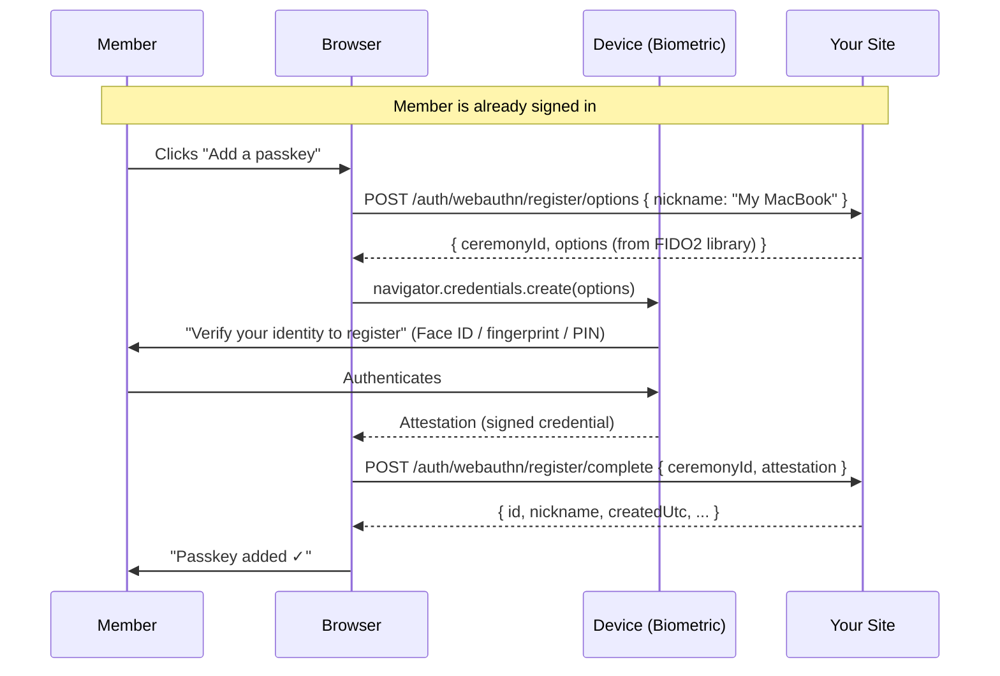
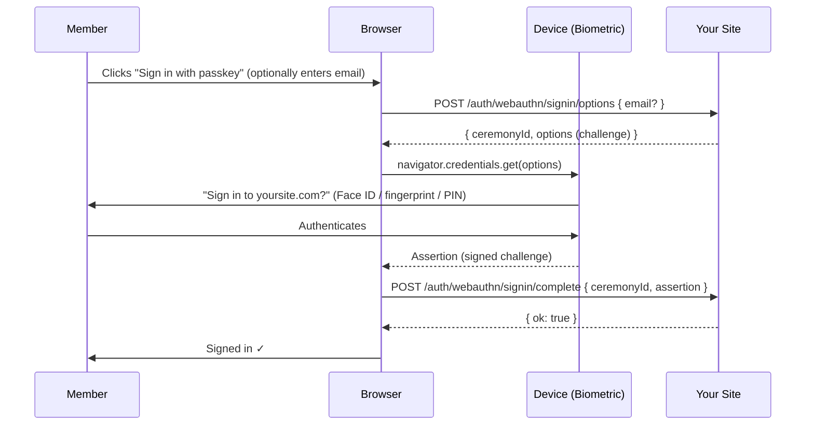

# Passkeys / WebAuthn Authentication

Passkeys are the newest and most secure sign-in method in this library. Instead of typing anything, members sign in using their device's built-in biometric or PIN — Face ID, fingerprint scanner, Windows Hello, or a USB security key. No email involved.

This page explains what passkeys are, how to set them up, and how to use all the supporting endpoints.

## What is a passkey?

When a member registers a passkey on your site, their device generates a unique cryptographic key pair:

- The **private key** stays on the device, protected by the device's secure enclave. It never leaves — not even to your server.
- The **public key** is sent to your server and stored in the database.

When the member signs in later, your server sends a challenge (a random string). The device signs the challenge with the private key. Your server verifies the signature using the stored public key. If it checks out, the member is signed in.

Because the private key never travels over the network and the signature is mathematically tied to your exact domain, passkeys are resistant to phishing, credential stuffing, and man-in-the-middle attacks.

**Supported authenticators include:**
- iPhone/iPad with Face ID or Touch ID (iCloud Keychain syncs passkeys across Apple devices)
- Android with fingerprint or face unlock (Google Password Manager syncs passkeys)
- Windows Hello (PIN, fingerprint, or face)
- USB security keys (YubiKey etc.)

## Two-phase setup: registration then sign-in

Unlike magic links or OTP where the member can immediately sign in with just their email, passkeys require the member to **register** a passkey first (while already authenticated via another method), and then use it to **sign in** on subsequent visits.

A common pattern is:
1. Member registers via magic link or OTP (first-time login)
2. After sign-in, the member page prompts them to add a passkey
3. On future visits, they can sign in directly with their passkey

## Registration flow

Registration requires the member to already be signed in.



## Sign-in flow



### Discoverable credentials

If the member doesn't provide an email at sign-in, the browser shows a list of passkeys the member has registered on any site. The member picks yours and authenticates. This is called a **discoverable credential** or **resident key** sign-in — no username field required.

If the member provides their email, the browser is given a hint list of exactly which credentials are valid, which can make the experience slightly faster on some devices.

## Configuration

All options live under `HCS:Authentication:WebAuthn` in `appsettings.json`.

| Key | Type | Default | Description |
|-----|------|---------|-------------|
| `Enabled` | bool | `true` | Enable or disable WebAuthn sign-in. Startup validation fails unless `DecoyHmacKey` (and `Origins` in production) are also configured. |
| `RpId` | string | `localhost` | **Your domain name** — e.g. `yoursite.com`. Must match the sign-in origin exactly. No `https://` prefix. |
| `RpName` | string | `Umbraco Site` | Human-friendly name for your site, shown during passkey prompts |
| `Origins` | string[] | `[]` | **Full origins** — e.g. `["https://yoursite.com"]`. Must include scheme. Required in production. |
| `TimeoutMs` | uint | `60000` | Milliseconds before the browser WebAuthn prompt times out |
| `UserVerification` | string | `Required` | `Required`, `Preferred`, or `Discouraged`. Required means the user must use biometrics/PIN. |
| `AttestationPreference` | string | `None` | `None`, `Indirect`, `Direct`, or `Enterprise`. `None` is suitable for most sites. |
| `ResidentKey` | string | `Required` | `Required`, `Preferred`, or `Discouraged`. Required enables passwordless (no username needed). |
| `AuthenticatorAttachment` | string? | `null` | `Platform` (biometric/PIN only), `CrossPlatform` (USB keys only), or `null` for any |
| `ChallengeTtl` | TimeSpan | `00:05:00` | How long a registration or sign-in challenge remains valid |
| `RequireAtLeastOneNonPasskeyFactor` | bool | `true` | Prevents a member from deleting their last passkey if no other sign-in method is enabled |
| `TimestampDriftToleranceMs` | int | `300000` | Allowed clock-skew window for WebAuthn timestamp validation in milliseconds. Allowed range: 30 000–600 000 ms (30 s to 10 min). |
| `SignInOptionsPerIpPerMinute` | int | `10` | Maximum sign-in options requests per IP address per minute |
| `SignInCompletePerIpPerMinute` | int | `5` | Maximum sign-in complete requests per IP address per minute |
| `DecoyHmacKey` | string | `null` | **Required.** Secret key (≥ 16 bytes UTF-8) used to generate decoy credential IDs for email-enumeration protection. Set this to a random value; startup validation fails if absent or too short. |

```json
"WebAuthn": {
    "Enabled": true,
    "RpId": "yoursite.com",
    "RpName": "Your Site",
    "Origins": [ "https://yoursite.com" ],
    "UserVerification": "Required",
    "ResidentKey": "Required",
    "DecoyHmacKey": "REPLACE-WITH-A-RANDOM-SECRET-AT-LEAST-16-BYTES"
}
```

> **Local development:** For `localhost`, you can omit `RpId` and `Origins` — they default to values that work with `http://localhost`. If you're running on a specific port (e.g. `:44350`), add `"https://localhost:44350"` to `Origins`.

## Credential management

Once a member has registered passkeys, they can view, rename, and delete them. This is typically exposed on the member's account page.

### List passkeys

```
GET /auth/webauthn/credentials
Authorization: required (member must be signed in)
```

Returns an array of credential objects:

```json
[
    {
        "id": "3fa85f64-5717-4562-b3fc-2c963f66afa6",
        "nickname": "My MacBook",
        "aaGuid": "adce0002-35bc-c60a-648b-0b25f1f05503",
        "createdUtc": "2025-01-15T10:30:00Z",
        "lastUsedUtc": "2025-05-09T08:15:00Z",
        "backupEligible": true,
        "backupState": true,
        "transports": "internal,hybrid"
    }
]
```

| Field | Description |
|-------|-------------|
| `id` | Unique row ID for credential management calls |
| `nickname` | Friendly name set during registration |
| `aaGuid` | Identifies the authenticator model (can be used to show device icons) |
| `createdUtc` | When this passkey was registered |
| `lastUsedUtc` | When this passkey was last used to sign in |
| `backupEligible` | Whether the passkey can be synced to a cloud service (e.g. iCloud Keychain) |
| `backupState` | Whether the passkey is currently backed up |
| `transports` | How the authenticator communicates — `internal` (built-in), `usb`, `nfc`, `hybrid` |

### Rename a passkey

```
PATCH /auth/webauthn/credentials/{id}
Authorization: required
Content-Type: application/json

{ "nickname": "My iPhone" }
```

Nicknames have a maximum length of 64 characters. Returns `200 { "ok": true }` on success.

### Delete a passkey

```
DELETE /auth/webauthn/credentials/{id}
Authorization: required
```

Returns `204 No Content` on success.

If the member tries to delete their **last** passkey and `RequireAtLeastOneNonPasskeyFactor` is `true` (the default), the request is rejected with `409 Conflict`. This prevents members from accidentally locking themselves out of their account.

## Counter regression detection

Each passkey assertion includes a **signature counter** that increments every time the passkey is used. The server tracks this counter and rejects sign-in if the received counter is lower than or equal to the stored value.

This is a security feature from the FIDO2 specification: if a passkey's counter goes backwards, it could indicate the credential has been copied to another device. When this happens, the library publishes a `PasskeyCounterRegressionNotification` event (see [Advanced → Notifications](advanced.md)) and rejects the sign-in attempt.

> **Note:** Not all authenticators increment the counter reliably. Platform passkeys synced via iCloud Keychain or Google Password Manager typically send a counter of `0`. This is handled correctly — a counter of `0` means "this authenticator doesn't track usage count", and the regression check is skipped.

## Front-end example

This example uses the browser's native WebAuthn API. For production use, consider a library like [SimpleWebAuthn](https://simplewebauthn.dev/) to handle base64url encoding/decoding.

```html
<!-- On the member account page (user already signed in) -->
<button id="add-passkey-btn">Add a passkey</button>
<ul id="passkey-list"></ul>

<script>
// ---- Registration ----
document.getElementById('add-passkey-btn').addEventListener('click', async () => {
    // 1. Get challenge options from server
    const optRes = await fetch('/auth/webauthn/register/options', {
        method: 'POST',
        headers: { 'Content-Type': 'application/json', 'RequestVerificationToken': getAntiForgery() },
        body: JSON.stringify({ nickname: 'My passkey' })
    });
    const { ceremonyId, options } = await optRes.json();

    // 2. Decode base64url fields required by the WebAuthn API
    options.challenge = base64urlDecode(options.challenge);
    options.user.id = base64urlDecode(options.user.id);
    options.excludeCredentials?.forEach(c => c.id = base64urlDecode(c.id));

    // 3. Prompt user for biometric/PIN
    const credential = await navigator.credentials.create({ publicKey: options });

    // 4. Send attestation to server
    await fetch('/auth/webauthn/register/complete', {
        method: 'POST',
        headers: { 'Content-Type': 'application/json', 'RequestVerificationToken': getAntiForgery() },
        body: JSON.stringify({
            ceremonyId,
            attestation: {
                id: credential.id,
                rawId: base64urlEncode(credential.rawId),
                type: credential.type,
                response: {
                    attestationObject: base64urlEncode(credential.response.attestationObject),
                    clientDataJSON: base64urlEncode(credential.response.clientDataJSON),
                    transports: credential.response.getTransports?.() ?? []
                }
            }
        })
    });

    alert('Passkey added!');
    loadPasskeys();
});

// ---- Sign-in (on your login page) ----
async function signInWithPasskey(email) {
    // 1. Get assertion options
    const optRes = await fetch('/auth/webauthn/signin/options', {
        method: 'POST',
        headers: { 'Content-Type': 'application/json' },
        body: JSON.stringify({ email: email ?? '' })
    });
    const { ceremonyId, options } = await optRes.json();

    options.challenge = base64urlDecode(options.challenge);
    options.allowCredentials?.forEach(c => c.id = base64urlDecode(c.id));

    // 2. Prompt user
    const assertion = await navigator.credentials.get({ publicKey: options });

    // 3. Send assertion
    const res = await fetch('/auth/webauthn/signin/complete', {
        method: 'POST',
        headers: { 'Content-Type': 'application/json' },
        body: JSON.stringify({
            ceremonyId,
            assertion: {
                id: assertion.id,
                rawId: base64urlEncode(assertion.rawId),
                type: assertion.type,
                response: {
                    authenticatorData: base64urlEncode(assertion.response.authenticatorData),
                    clientDataJson: base64urlEncode(assertion.response.clientDataJSON),
                    signature: base64urlEncode(assertion.response.signature),
                    userHandle: assertion.response.userHandle
                        ? base64urlEncode(assertion.response.userHandle) : null
                }
            }
        })
    });

    if (res.ok) window.location.href = '/member';
}
</script>
```

## Testing checklist

- [ ] Register a passkey while signed in — credential appears in the list
- [ ] Sign out and sign back in using the passkey
- [ ] Rename the passkey — name updates in the list
- [ ] Delete the passkey — it disappears from the list
- [ ] Try to delete the last passkey when `RequireAtLeastOneNonPasskeyFactor` is `true` — you get a `409` response
- [ ] On production: verify `RpId` and `Origins` exactly match your domain — any mismatch causes the browser to refuse the ceremony silently
